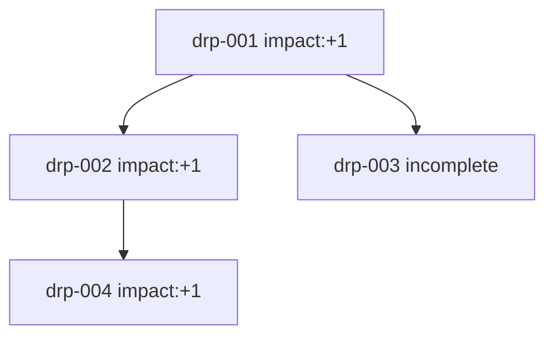
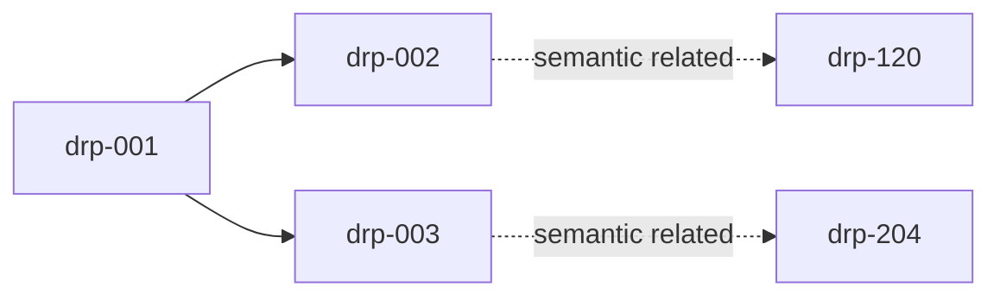

# Decision Record Protocol (DRP)

## 1. Metadata

- Name: Decision Record Protocol (DRP)
- Level: Meta / Cross-layer Support
- Status: Experimental
- Version: v0.1
- Scope Type: Documentation and analysis support

---

## 1.1 Protocol Status Model

- `draft` — structure is evolving and not ready for cross-team dependency.
- `experimental` — usable for controlled adoption with active feedback.
- `stable` — format is versioned and expected to be backward compatible within major versions.

Current status: `experimental`.

Breaking schema changes MUST increment major version.

---

## 2. Purpose

**TL;DR:** DRP is a formal memory of decisions and outcomes across time.

DRP defines a strict specification to record decision context, selected actions, outcomes, impacts, and graph links.

Without DRP, decision traces fragment across systems, causal attribution weakens, and repeated mistakes become harder to detect.

DRP MUST preserve traceability across time so historical decisions can be audited and compared.

DRP records decisions only and MUST NOT execute, validate, or optimize decisions.

---

## 3. Scope & Non-Goals

**TL;DR:** DRP stores and traces decisions; it does not decide or execute.

### DRP IS

- a decision memory
- a trace system
- an analysis support layer

### DRP IS NOT

- a decision engine
- an optimization engine
- an execution system

DRP MUST NOT:

- trigger actions
- influence decision selection
- act as memory for execution reuse

---

## 4. Core Principles

**TL;DR:** DRP guarantees consistent, auditable decision records.

- DRP MUST treat each DRP Record as a decision trace artifact.
- DRP MUST keep causal order explicit.
- DRP MUST keep semantic similarity separate from execution authority.
- DRP MUST preserve Level 0 (Safety) and Level 1 (Human Consent) precedence.

---

## 5. Protocol Relationships

**TL;DR:** DRP supports other protocols through recording only.

### Supports

- CQMP — records branch exploration and selected branch outcomes. See [docs/protocols/Conditional_Quantum_Mode.md](./Conditional_Quantum_Mode.md) and [guardrails/CONDITIONAL_QUANTUM_MODE_PROTOCOL.md](../../guardrails/CONDITIONAL_QUANTUM_MODE_PROTOCOL.md).
- MRP — records executed minimal-resolution actions and consequences. See [guardrails/MINIMAL_RESOLUTION_PROTOCOL.md](../../guardrails/MINIMAL_RESOLUTION_PROTOCOL.md).
- EIP — records ambiguity/error detection and resulting outcomes. See [guardrails/ERROR_ILLUMINATION_PROTOCOL.md](../../guardrails/ERROR_ILLUMINATION_PROTOCOL.md).

### Does NOT override

- Level 0 — Safety
- Level 1 — Human Consent

DRP MUST remain subordinate to hierarchy constraints.

---

## 6. Record Schema (Formal Table)

**TL;DR:** Use one normalized schema with strict names and constraints.

| Field | Type | Required | Constraints | Description |
| --- | --- | --- | --- | --- |
| `record_id` | string | MUST | Unique within dataset | DRP Record identifier |
| `context` | string | MUST | Non-empty | Decision-time context; MUST explain why, not only what |
| `options` | array<string> | MUST | Length >= 1 | Viable options considered |
| `decision` | string | MUST | Non-empty | Selected option |
| `status` | enum | MUST | `proposed` \| `complete` \| `incomplete` \| `superseded` | DRP Record state |
| `outcome` | string or null | MUST | Null allowed only when unresolved | Observed result |
| `impact` | enum or null | MUST | `-1` \| `0` \| `+1` \| `null` | Outcome impact value |
| `timestamp` | string | MUST | ISO 8601 | Decision timestamp |
| `parent_record_ids` | array<string> | MUST | Empty only for root records | Direct causal parents |
| `child_record_ids` | array<string> | MUST | Empty allowed | Direct causal children |
| `related_records` | array<string> | MAY | Semantic references only | Meaning-based links |
| `actors_involved` | array<string> | MAY | Unique IDs only | Associated actors |
| `confidence_level` | number | MAY | 0 <= x <= 1 | Analysis confidence field |
| `source_of_decision` | string | MAY | `CQMP` \| `linear` \| `human` | Origin label |
| `semantic_index` | string/object reference | MAY | Versioned reference | Embedding index identifier |
| `supersedes_record_id` | string | MAY | References a replaced DRP Record | Identifier of the superseded DRP Record |

### ENUM Definitions

- `status`: `proposed`, `complete`, `incomplete`, `superseded`
- `impact`: `-1`, `0`, `+1`

### Status Definitions

- `proposed` — decision is defined and execution has not started.
- `incomplete` — execution started but outcome not yet observed.
- `complete` — outcome and impact are observed.
- `superseded` — decision is replaced by a newer DRP Record.

---

## 7. Field Semantics (Rules)

**TL;DR:** Field values MUST obey machine-checkable invariants.

### Explicit Invariants (IF/THEN)

- IF `status = complete`, THEN `outcome != null` AND `impact != null`.
- IF `status = incomplete`, THEN `outcome = null` AND `impact = null`.
- IF `status = proposed`, THEN `outcome = null` AND `impact = null`.
- IF `status = superseded`, THEN `supersedes_record_id != null`.
- IF `status = superseded`, THEN a newer DRP Record MUST reference this DRP Record via its `supersedes_record_id`.
- IF DRP Record A supersedes DRP Record B, THEN `A.supersedes_record_id = B.record_id`.
- IF DRP Record B is superseded, THEN `B.status = superseded`.
- IF DRP Record A supersedes DRP Record B, THEN supersession MUST be forward-declared (A → B) and MUST NOT require mutation of DRP Record B except `status`.
- IF multiple DRP Records reference the same `supersedes_record_id`, THEN this condition MUST be flagged as a conflict by external validation systems.
- IF `parent_record_ids = []`, THEN the DRP Record is a root record.
- IF `timestamp` is present, THEN `timestamp` MUST parse as ISO 8601.
- IF a DRP Record is created, THEN `record_id` MUST be unique in the dataset.

### Decision Integrity Rules (ADR-aligned)

- One DRP Record MUST represent one decision event.
- DRP Records MUST be append-only.
- History MUST NOT be rewritten.
- Changes MUST create new DRP Records, not in-place edits.
- `context` MUST capture rationale (why), not only action text (what).

### Immutability Rules

DRP Records are append-only in structure, but allow controlled field completion for:

- `status`
- `outcome`
- `impact`

Rules:

- IF a DRP Record exists, THEN only `status`, `outcome`, and `impact` MAY be modified.
- IF a field is not `status`, `outcome`, or `impact`, THEN it MUST remain immutable after creation.
- IF `parent_record_ids` or `child_record_ids` would change, THEN a new DRP Record MUST be created.

---

## 8. Lifecycle (Behavior)

**TL;DR:** Create once, complete with evidence, preserve history.

Section 7 is the single source of truth for invariants. Section 8 defines transition flow only.

### Decision Status Evolution

`proposed → incomplete → complete`

`proposed → complete` is allowed when execution and outcome observation are immediate.

`complete → superseded` is allowed ONLY when a newer DRP Record replaces the previous decision.

Lifecycle rules:

- IF a decision is formed, THEN a DRP Record MUST be created.
- IF new evidence appears, THEN only `status`, `outcome`, and `impact` MAY be updated.
- IF lifecycle transitions occur, THEN all Section 7 invariants MUST remain satisfied.
- IF a DRP Record is superseded, THEN prior DRP Records MUST be preserved.
- IF no execution occurs, THEN a DRP Record MAY remain indefinitely in `proposed` state.

---

## 9. Graph Model (Causality + Paths)

**TL;DR:** DRP has two graph layers: causal and path-level trace.

### 9.1 Causal Graph (parent-child)

- Causal edges are defined by `parent_record_ids` and `child_record_ids`.
- Causal graph MUST represent time-consistent dependencies.
- Root DRP Records MUST have no parents.

### 9.2 Path Model

- A path is an ordered causal sequence: `DRP_1 → DRP_2 → DRP_3`.
- Paths MAY branch.
- Paths MAY remain incomplete.
- Paths MAY use `path_id` in analysis contexts.
- Path identity MUST NOT influence execution behavior.

### Formal Causality Rules

- IF A is parent of B, THEN `A.timestamp <= B.timestamp`.
- IF `A.timestamp > B.timestamp`, THEN the A→B parent reference MUST be flagged as invalid.
- IF a causal cycle exists, THEN it SHOULD be flagged for review by external validation systems.

---

## 10. Semantic Layer

**TL;DR:** Semantic links accelerate lookup, never execution.

### 10.1 Semantic Graph (related_records)

- Semantic edges are defined by `related_records`.
- `related_records` MAY be asymmetric.
- Symmetry is NOT required.
- Semantic edges represent meaning similarity, not temporal causality.
- Semantic links MUST NOT imply causality.
- Semantic similarity MUST NOT be used as a substitute for causal linkage.
- Semantic graph MUST remain separate from causal authority.

### 10.2 Semantic Matching Guarantees

- Semantic matching MUST NOT affect decision execution.
- Semantic matching MUST NOT override hierarchy or protocols.
- Semantic matching MUST NOT mutate DRP Records.

### 10.3 Similarity Threshold Governance

- Threshold configuration MUST be versioned.
- Embedding model/version MUST be logged.
- Similarity score MUST be included in lookup response.

### 10.4 DRP Lookup Behavior

When a semantic match is accepted, DRP MUST return stored evidence fields:

- `decision`
- `outcome`
- `impact`
- `source_record_id`
- `similarity`

DRP lookup MUST remain read-only.

### 10.5 Lookup Trace Record (Separate Structure)

Lookup traces SHOULD be stored as separate records (not DRP Records).

```json
{
  "query_timestamp": "2026-03-31T08:00:00Z",
  "threshold_version": "semantic_threshold_v1",
  "embedding_model": "text-embedding-v1",
  "similarity": 0.91,
  "source_record_id": "drp-2026-03-30-001"
}
```

### 10.6 Semantic Matching Limitations

- Semantic matches are advisory signals, not ground truth.
- A semantic match MUST be overridable by authoritative context, safety policy, or human consent constraints.
- Similarity alone MUST NOT be treated as factual equivalence between DRP Records.

---

## 11. Constraints

**TL;DR:** DRP is strict, passive, and hierarchy-safe.

- DRP MUST record decisions only.
- DRP MUST NOT modify decision execution.
- DRP MUST NOT optimize actor behavior.
- DRP MUST preserve Level 0 and Level 1 precedence.
- IF high-volume workloads occur, THEN audit quality SHOULD be preserved.
- Duplicate DRP Records representing the same decision event SHOULD be avoided.
- IF duplicate DRP Records occur, THEN they MUST be linked via `related_records` or resolved via supersession.

### Formal Guarantees

DRP guarantees:

- No hidden mutation of decision history
- No execution influence from stored records
- Deterministic trace reconstruction (given complete data)
- Separation of causal and semantic graphs

### Known Limitations

- DRP has no automatic learning authority.
- DRP has no decision authority.
- DRP quality depends on input DRP Record quality.

---

## 12. Data Quality Rules

**TL;DR:** Invalid structure MUST be detectable and reviewable.

Section 7 is the single source of truth for invariants. Section 12 defines validation-quality checks and external flagging requirements.

- `record_id` MUST be unique.
- `timestamp` MUST be valid ISO 8601.
- `impact` MUST be `-1`, `0`, or `+1` when present.
- IF A appears in `B.parent_record_ids`, THEN B MUST NOT have an earlier `timestamp` than A.
- IF A appears in `B.child_record_ids`, THEN A MUST NOT have a later `timestamp` than B.
- IF DRP Record A lists DRP Record B in `child_record_ids`, THEN DRP Record B MUST eventually list DRP Record A in `parent_record_ids`.
- IF parent/child eventual consistency is not satisfied, THEN this condition MUST be flagged by external validation systems.
- IF parent/child links are eventually consistent, THEN external validation systems MUST NOT require synchronous mutation.
- IF a rule in this section is violated, THEN the violation MUST be flagged by external validation systems.
- IF a DRP Record has non-empty `parent_record_ids` and none of those parent DRP Records exist, THEN the DRP Record is an orphan and MUST be flagged by external validation systems.
- IF two DRP Records share equivalent `context`, equivalent `decision`, and close `timestamp` values within a defined window, THEN they SHOULD be flagged as potential duplicates by external validation systems.
- IF a semantic lookup trace is recorded, THEN it SHOULD include `query_timestamp`, `threshold_version`, `embedding_model`, `similarity`, and `source_record_id`.

---

## 13. Validation Readiness

**TL;DR:** DRP is validator-ready by design, but validators are out of scope.

- All invariants in this specification are designed to be machine-checkable.
- All invariants defined in this document MUST be externally verifiable without ambiguity.
- DRP is validator-ready and contains ONLY declarative constraints.
- DRP does NOT include validation logic.
- Validation tooling is external to this repository.

---

## 14. Failure Modes

**TL;DR:** Missing evidence keeps records incomplete; no fabrication.

- IF outcome is unobserved after execution starts, THEN DRP Record MUST remain `incomplete`.
- IF `status = incomplete`, THEN Section 7 invariants MUST be satisfied.
- IF `outcome` is unobserved, THEN fabricated outcomes MUST NOT be recorded.
- IF `impact` is unobserved, THEN fabricated impact values MUST NOT be recorded.

---

## 15. Examples

**TL;DR:** Examples show valid, partial, and invalid cases.

Examples MAY be partial for illustration, but MUST NOT be treated as schema-valid unless explicitly marked as `VALID EXAMPLE`.

### 15.1 PARTIAL EXAMPLE — Minimal Example (Illustrative, Not Schema-Valid)

NOTE: This is a partial example for illustration only (not schema-valid).

```json
{
  "record_id": "drp-min-001",
  "context": "User request requires escalation",
  "decision": "route_to_human",
  "status": "proposed",
  "timestamp": "2026-03-30T12:00:00Z"
}
```

### 15.2 VALID EXAMPLE — Valid Branching Path (Multiple Records)

```json
[
  {
    "record_id": "drp-2026-03-30-001",
    "context": "Incoming support request with unclear ownership",
    "options": ["route_to_human", "route_to_bot"],
    "decision": "route_to_human",
    "status": "complete",
    "outcome": "Case triaged by specialist",
    "impact": 1,
    "timestamp": "2026-03-30T09:00:00Z",
    "parent_record_ids": [],
    "child_record_ids": ["drp-2026-03-30-002", "drp-2026-03-30-003"],
    "related_records": [],
    "actors_involved": ["agent-1"],
    "confidence_level": 0.87,
    "source_of_decision": "human",
    "semantic_index": "semantic-index-v1"
  },
  {
    "record_id": "drp-2026-03-30-002",
    "context": "Follow-up on specialist route",
    "options": ["request_logs", "close_case"],
    "decision": "request_logs",
    "status": "complete",
    "outcome": "Logs received",
    "impact": 1,
    "timestamp": "2026-03-30T09:05:00Z",
    "parent_record_ids": ["drp-2026-03-30-001"],
    "child_record_ids": [],
    "related_records": ["drp-2026-03-31-120"],
    "actors_involved": ["agent-2"],
    "confidence_level": 0.8,
    "source_of_decision": "CQMP",
    "semantic_index": "semantic-index-v1"
  },
  {
    "record_id": "drp-2026-03-30-003",
    "context": "Automation alternative branch",
    "options": ["route_to_bot", "escalate_human"],
    "decision": "route_to_bot",
    "status": "incomplete",
    "outcome": null,
    "impact": null,
    "timestamp": "2026-03-30T09:06:00Z",
    "parent_record_ids": ["drp-2026-03-30-001"],
    "child_record_ids": [],
    "related_records": [],
    "actors_involved": ["agent-3"],
    "confidence_level": 0.42,
    "source_of_decision": "linear",
    "semantic_index": "semantic-index-v1"
  }
]
```

### 15.3 VALID EXAMPLE — Incomplete DRP Record

```json
{
  "record_id": "drp-2026-03-30-010",
  "context": "External dependency status unknown",
  "options": ["wait", "fallback"],
  "decision": "wait",
  "status": "incomplete",
  "outcome": null,
  "impact": null,
  "timestamp": "2026-03-30T10:00:00Z",
  "parent_record_ids": [],
  "child_record_ids": [],
  "related_records": [],
  "actors_involved": ["agent-4"],
  "confidence_level": 0.5,
  "source_of_decision": "human",
  "semantic_index": "semantic-index-v1"
}
```

### 15.4 PARTIAL EXAMPLE — Semantic Lookup Match Response

```json
{
  "query": "Need specialist for ambiguous support issue",
  "threshold_version": "semantic_threshold_v1",
  "threshold": 0.85,
  "embedding_model": "text-embedding-v1",
  "matches": [
    {
      "source_record_id": "drp-2026-03-30-001",
      "similarity": 0.91,
      "decision": "route_to_human",
      "outcome": "Case triaged by specialist",
      "impact": 1,
      "timestamp": "2026-03-30T09:00:00Z"
    }
  ]
}
```

### 15.5 INVALID EXAMPLE — Violates Required Invariants

```json
{
  "record_id": "drp-invalid-001",
  "context": "Follow-up decision",
  "options": ["close_case"],
  "decision": "close_case",
  "status": "complete",
  "outcome": null,
  "impact": null,
  "timestamp": "2026-03-30T08:00:00Z",
  "parent_record_ids": ["drp-2026-03-30-999"],
  "child_record_ids": []
}
```

Why invalid:

- Violates invariant: IF `status = complete`, THEN `outcome != null`.
- Violates invariant: IF `status = complete`, THEN `impact != null`.
- Violates data quality rule when referenced parent does not exist (orphan condition).

### 15.6 Mermaid — Branching + Impact



### 15.7 Mermaid — Causal vs Semantic



---

## 16. Alternatives Considered

### Recomputation-only approach

- Recompute each decision from scratch every time.
- Strength: no storage overhead.
- Limitation: weak traceability and repeated analysis cost.

### Simple cache approach

- Store outputs keyed by surface query only.
- Strength: low complexity.
- Limitation: weak causal context, weak audit quality, and semantic drift risk.

### DRP approach

- Store normalized decision records with causal and semantic links.
- Strength: high auditability, path reconstruction, and reusable analysis evidence.
- Limitation: depends on DRP Record quality and governance discipline.

---

## 17. Rationale

DRP formalizes DRP Record memory with strict constraints and explicit graph semantics.

Without DRP, systems lose consistent decision history, traceability decreases, and repeated mistakes are harder to identify.

DRP enables:

- auditable trace chains
- causal path reconstruction
- semantic retrieval for analysis reuse

DRP preserves protocol safety by remaining read-oriented, non-intrusive, and hierarchy-subordinate.

---

## 18. Summary

DRP does:

- record decision context, decision, outcome, and impact
- preserve causal and semantic trace links for analysis
- provide read-only lookup evidence for prior records

DRP does NOT:

- execute decisions
- validate decision correctness
- optimize decision policy

### Anti-Patterns

DRP is NOT:

- a cache
- a decision engine
- a replacement for reasoning

---

## Appendix A — Implementation Guidelines (Non-Normative)

- Append-only storage is RECOMMENDED to preserve audit history.
- Batch ingestion is RECOMMENDED for high-volume DRP Record streams.
- Indexing `record_id`, `timestamp`, `impact`, and `status` improves query performance.
- Graph databases (for example Neo4j) MAY be used for causal/semantic traversal.
- Vector indexes MAY be separated from canonical DRP storage to reduce coupling.
